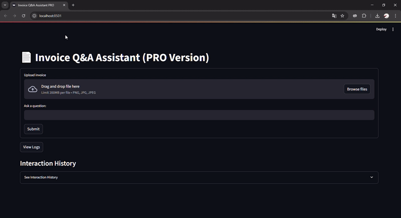

# Invoice Q&A Assistant PRO



## Overview
Invoice Q&A Assistant PRO is a Streamlit-based web application designed to extract text from uploaded invoice images (PNG, JPG, JPEG) and answer user queries about the content using advanced OCR, text processing, and question-answering capabilities. The application leverages EasyOCR for text extraction, HuggingFace for embeddings and QA models, and FAISS for efficient vector-based search. It includes robust logging, database storage for interactions, and editable outputs for user corrections, making it ideal for professional and enterprise use cases.

## Features
- **Image Upload & OCR**: Upload invoices and extract text using EasyOCR with preprocessing for improved accuracy.
- **Question Answering**: Ask questions about the invoice, answered using a BERT-based QA model with fuzzy matching for robustness.
- **Text Processing**: Formats and chunks extracted text for efficient querying, with dynamic delimiter support.
- **Database Logging**: Stores interactions, extracted text, and corrections in an SQLite database for traceability.
- **Editable Outputs**: Allows users to edit extracted text, formatted text, chunked text, and outcomes, with changes saved to the database.
- **Interaction History**: Displays a history of questions, answers, and confidence scores.
- **Professional Logging**: Comprehensive logging to `rag_pipeline.log` and `debug_pipeline.log` for debugging and monitoring.

## Installation

### Prerequisites
- Python 3.8+
- Git
- A compatible environment with GPU support (optional, for faster QA model performance)

### Steps
1. Clone the repository:
   ```bash
   git clone https://github.com/your-username/invoice-qa-assistant-pro.git
   cd invoice-qa-assistant-pro
   ```

2. Create and activate a virtual environment:
   ```bash
   python -m venv venv
   source venv/bin/activate  # On Windows: venv\Scripts\activate
   ```

3. Install dependencies:
   ```bash
   pip install -r requirements.txt
   ```

4. Run the application:
   ```bash
   streamlit run app.py
   ```

## Requirements
The required Python packages are listed in `requirements.txt`. Key dependencies include:
- `streamlit` for the web interface
- `easyocr` for OCR
- `langchain-huggingface` and `transformers` for embeddings and QA
- `faiss-cpu` for vector search
- `sqlite3` for database storage
- `opencv-python` and `Pillow` for image processing

See `requirements.txt` for the full list.

## Usage
1. Launch the app using `streamlit run app.py`.
2. Upload an invoice image (PNG, JPG, or JPEG).
3. View the preprocessed image and extracted text in real-time.
4. Ask a question about the invoice (e.g., "What is the total amount?").
5. Review and edit extracted text, formatted text, chunked text, or outcomes.
6. Submit corrections to update the database.
7. View interaction history and logs for debugging.

## Project Structure
- `app.py`: Main application script with Streamlit interface, OCR, and QA logic.
- `requirements.txt`: Lists all Python dependencies.
- `rag_pipeline.log`: Logs application events.
- `debug_pipeline.log`: Detailed debug logs.
- `logs.db`: SQLite database for storing interactions and corrections.

## Future Improvements
- Add support for more languages in EasyOCR.
- Implement real-time OCR feedback with confidence scores.
- Enhance QA model with domain-specific fine-tuning for invoices.
- Add export functionality for interaction history.

## Contributing
Contributions are welcome! Please submit a pull request or open an issue for suggestions, bug reports, or feature requests.

## License
See the `LICENSE` file for details.

## Contact
For inquiries, please reach out to [your-email@example.com](mailto:your-email@example.com) or open an issue on GitHub.
